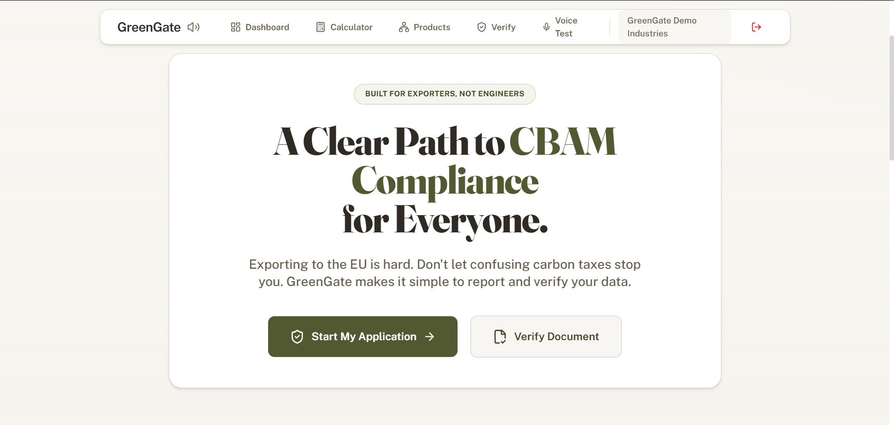
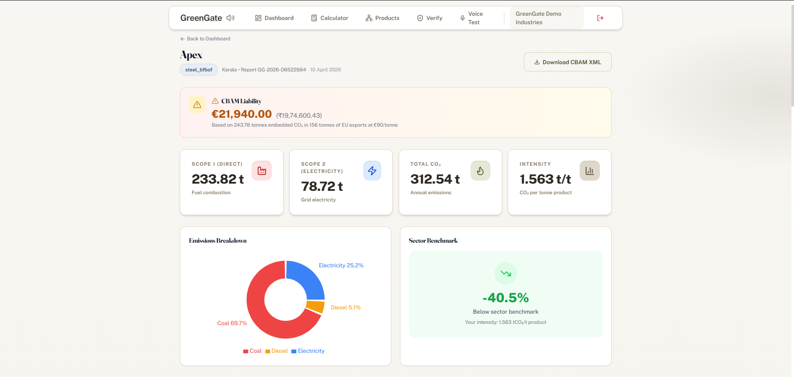
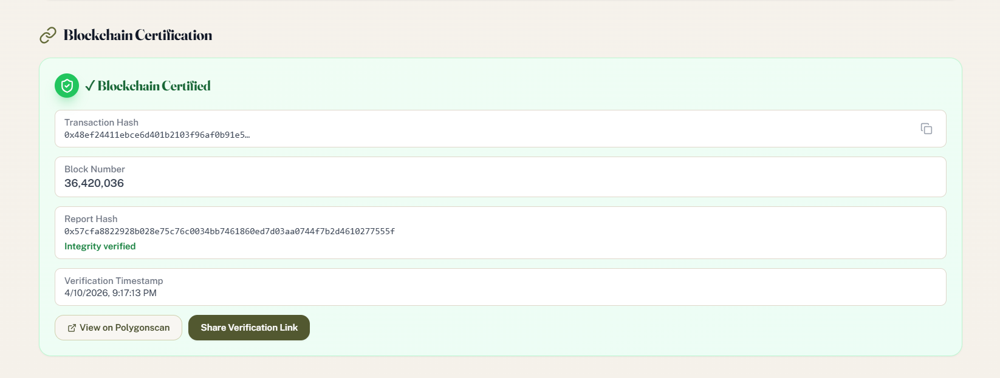

# GreenGate

> **Carbon data that cannot be trusted should not be certified.** GreenGate turns noisy industrial inputs into verified carbon evidence for CBAM-ready MSMEs.

[](LICENSE)
[]()
[]()
[]()

---

##  Overview

GreenGate is a **Carbon Data Trust Engine** for industrial MSMEs that need to report carbon data with confidence. Instead of treating every input as equally valid, GreenGate checks whether the underlying data is internally consistent, physically plausible, behaviorally stable, and backed by evidence.

That matters because CBAM exposure is not just about emissions volume. It is about whether the reported data can survive scrutiny from buyers, auditors, and regulators.

> **Callout:** GreenGate validates trust before it computes outcomes.

---

##  Problem Statement

Carbon reporting often fails at the input layer, not the calculation layer.

- Industrial data is frequently incomplete, estimated, duplicated, or manually edited.
- MSMEs usually do not have dedicated sustainability teams, audit trails, or data governance systems.
- Under CBAM, weak data quality can lead to incorrect disclosures, financial penalties, and reputational risk.

In practice, many tools tell companies how much carbon they emit. Far fewer tools can tell them whether the data driving that number is actually trustworthy.

---

##  Solution

GreenGate is built as a **trust layer for carbon reporting**.

It does not behave like a simple calculator. It acts like a carbon data validator that inspects electricity, production, and fuel inputs before those inputs are converted into compliance-ready outputs.

The result is a more defensible reporting workflow for MSMEs, with fewer blind spots and less risk of passing bad data downstream into CBAM submissions.

---

##  Key Innovation

**Carbon Data Trust Engine**

**Multi-layer validation system**

What makes GreenGate different is the sequence of verification logic. Existing calculators mostly assume the data is valid. GreenGate challenges that assumption first.

> GreenGate is not designed to only answer: “How much carbon?”
>
> It is designed to answer: “Should this carbon data be trusted at all?”

---

##  How It Works

### 1. Multi-variable consistency checks

GreenGate compares electricity, production, and fuel inputs against each other. If a factory claims unusually low energy use for unusually high output, the system flags the mismatch.

This layer catches human error, unit mistakes, and obviously contradictory submissions early.

### 2. Physical / process constraint validation

The engine checks whether values are physically plausible for the process, scale, and operating context. Inputs that fall outside reasonable industrial bounds are downgraded in trust.

This prevents impossible or highly suspicious data from being treated as reliable evidence.

### 3. Behavioral anomaly detection

GreenGate looks for patterns that do not fit the historical or operational behavior of the site. Sudden spikes, sharp reversals, or unstable reporting trends are treated as risk signals.

This helps detect manipulation, inconsistent manual entry, and data drift.

### 4. Evidence-based verification

When confidence is low, the system asks for support: PDFs, invoices, logs, meter records, or other proof artifacts.

This creates a practical trust workflow instead of forcing users to defend weak data with assumptions.

---

##  Features

| Feature | What it does |
|---|---|
| Data validation engine | Screens industrial inputs before they are used in compliance reporting |
| Reliability score | Produces a trust score for each submission |
| Anomaly detection | Flags suspicious patterns and outliers |
| Benchmark comparison | Compares reported intensity against sector expectations |
| Evidence-based scoring | Strengthens low-confidence data with supporting documents |
| CBAM-oriented workflow | Focuses on export risk, auditability, and reporting quality |
| Public verification | Enables external verification of trusted outputs |
| Optional blockchain anchoring | Preserves report integrity for immutable certification |

---

##  Demo Flow

1. The user enters industrial data such as electricity, production volume, and fuel usage.
2. GreenGate validates the submission across multiple trust layers.
3. The engine generates a reliability score, risk flags, and an explanation of what failed or passed.
4. If confidence is weak, the system requests evidence before certification.
5. The user receives a compliance-oriented trust summary instead of a blind emission number.

---

##  Screenshots





---

##  Tech Stack

| Layer | Technology |
|---|---|
| Frontend | React + Vite + TailwindCSS |
| Backend | FastAPI + SQLAlchemy + SQLite |
| Logic Layer | Python validation engine + benchmark rules + anomaly scoring |
| Optional Verification | Polygon / Hardhat / web3.py |
| AI Support | Cerebras / local fallback services |

**Badges**

[]()
[]()
[]()
[]()
[]()
[]()

---

##  Example Output

```json
{
  "score": 82,
  "risk": "medium",
  "flags": [
    "electricity-use inconsistent with output",
    "diesel intensity above expected range",
    "supporting evidence recommended"
  ],
  "explanation": "Submission is partially credible but requires evidence before certification. The data is internally inconsistent and exceeds expected behavioral thresholds for the declared process."
}
```

---

## 🔍 Competitive Advantage

| Category | Carbon Calculators | ESG Tools | GreenGate |
|---|---|---|---|
| Primary focus | Emission estimation | Reporting and disclosure | Data trust and validation |
| Input quality control | Limited | Partial | Strong multi-layer validation |
| CBAM readiness | Often indirect | Broad | Directly aligned |
| Evidence handling | Rare | Sometimes | Core workflow |
| Risk detection | Minimal | Moderate | Built-in anomaly and constraint checks |
| Output value | A number | A report | A trustworthy reporting decision |

GreenGate is not competing on calculation only. It competes on **confidence, auditability, and compliance readiness**.

---

##  Future Scope

- ML-based validation models for richer anomaly detection
- Direct ERP / MES / utility API integrations
- Blockchain verification for tamper-resistant certification
- Real-time telemetry validation for live factory data
- Supplier graph intelligence for broader Scope 3 trust analysis

---

##  Conclusion

GreenGate is built for a real compliance problem: carbon reporting only works when the underlying data can be trusted.

By validating data before certification, GreenGate helps MSMEs reduce CBAM risk, improve reporting quality, and move from uncertain disclosure to defensible compliance.

**GreenGate turns carbon data into carbon evidence.**
