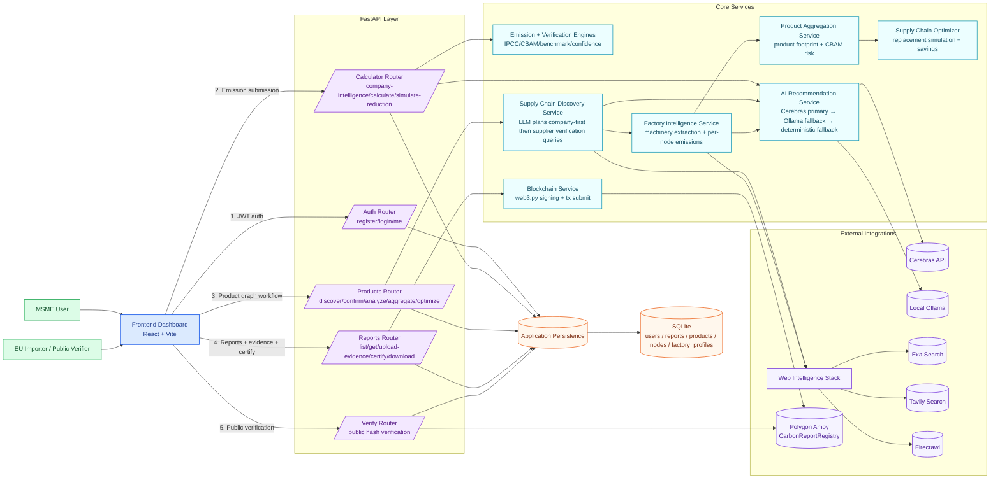

# 🌿 GreenGate — AI + Blockchain CBAM Carbon Compliance Platform

**For Indian MSME Exporters**

GreenGate helps Indian MSMEs exporting to the European Union comply with the **Carbon Border Adjustment Mechanism (CBAM)** regulation. It calculates carbon emissions, generates AI-powered reduction recommendations, and stores immutable certificates on the Polygon blockchain.

---

## 🛠 Tech Stack

| Layer            | Technology                                        |
|-----------------|---------------------------------------------------|
| **Frontend**     | React + Vite + TailwindCSS + ethers.js            |
| **Backend**      | Python FastAPI + SQLAlchemy + web3.py + OpenAI SDK |
| **Database**     | SQLite                                            |
| **Blockchain**   | Polygon Amoy Testnet (EVM-compatible)              |
| **Smart Contract** | Solidity 0.8.x (Hardhat)                       |
| **AI Engine**    | Rule-based IPCC calculator + Cerebras/Ollama fallback stack |

---

## 🚀 Quick Start

### Prerequisites

- **Node.js** ≥ 18
- **Python** ≥ 3.10
- **MetaMask** browser extension
- (Optional) **OpenAI API Key** for AI recommendations

### 1. Blockchain Setup (do this FIRST)

```bash
cd blockchain
npm install
npx hardhat compile
```

To deploy to Polygon Amoy testnet:

1. Get a wallet private key and add test MATIC from <https://faucet.polygon.technology>
2. Update `blockchain/.env` with your `DEPLOYER_PRIVATE_KEY`
3. Run:

```bash
npx hardhat run scripts/deploy.js --network amoy
```

1. Copy the printed `CONTRACT_ADDRESS` to `backend/.env` and `frontend/.env`

### 2. Backend Setup

```bash
cd backend
pip install -r requirements.txt
```

Edit `backend/.env`:

- Set `OPENAI_API_KEY` (optional — fallback recommendations will be used if not set)
- Set `SIGNER_PRIVATE_KEY` (your backend wallet private key for blockchain submissions)
- Set `CONTRACT_ADDRESS` (from Step 1)

Start the server:

```bash
uvicorn main:app --reload --port 8000
```

### 3. Frontend Setup

```bash
cd frontend
npm install
npm run dev
```

The app will be available at **<http://localhost:5173>**

### 4. MetaMask Setup

1. Install **MetaMask** browser extension
2. The app will automatically prompt you to add **Polygon Amoy** network
3. Get free test MATIC from: <https://faucet.polygon.technology>

---

## 📋 Features

- **🔬 AI Carbon Calculator** — Uses IPCC/CEA emission factors for accurate Scope 1 & 2 calculations
- **🤖 AI Recommendations** — Cerebras-first with local fallback and deterministic backup recommendations
- **🔗 Blockchain Certification** — Immutable report hashes on Polygon for trustless verification
- **✅ Public Verification** — EU importers can verify certificates without any login
- **📊 CBAM Reports** — Downloadable reports in EU-compatible format
- **📈 Sector Benchmarks** — Compare your emissions against industry standards
- **🏭 Product Supply Chain Discovery** — LLM-planned company/supplier verification queries + graph-based traceability
- **🧪 Factory Intelligence + Optimization** — Per-factory emissions analysis and supplier replacement simulation
- **📎 Evidence Upload Workflow** — Support low-confidence reports with PDF evidence before certification

---

## 🧭 Architecture Flow



---

## 🌐 API Endpoints

| Method | Endpoint                          | Auth     | Description                      |
|--------|-----------------------------------|----------|----------------------------------|
| POST   | `/auth/register`                  | No       | Register MSME user               |
| POST   | `/auth/login`                     | No       | Login and get JWT token          |
| GET    | `/auth/me`                        | JWT      | Get user profile                 |
| POST   | `/api/company-intelligence`       | JWT      | Discover company profile hints   |
| POST   | `/api/calculate`                  | JWT      | Calculate carbon emissions       |
| POST   | `/api/simulate-reduction`         | JWT      | Simulate reduction actions       |
| GET    | `/api/reports`                    | JWT      | List user's reports              |
| GET    | `/api/reports/{id}`               | JWT      | Get full report details          |
| POST   | `/api/reports/{id}/upload-evidence` | JWT    | Upload evidence PDFs             |
| POST   | `/api/reports/{id}/certify`       | JWT      | Certify report on blockchain     |
| GET    | `/api/reports/{id}/download`      | JWT      | Download CBAM report as JSON     |
| POST   | `/api/products/discover`          | JWT      | Discover product supply chain    |
| POST   | `/api/products/{id}/confirm-supply-chain` | JWT | Confirm/edit discovered graph |
| GET    | `/api/products/{id}`              | JWT      | Get product detail + graph       |
| POST   | `/api/products/{id}/analyze-factories` | JWT  | Run per-factory intelligence     |
| POST   | `/api/products/{id}/aggregate-carbon` | JWT   | Aggregate product-level carbon   |
| POST   | `/api/products/{id}/optimize`     | JWT      | Simulate supplier replacement    |
| GET    | `/api/verify/{hash}`              | **No**   | Public certificate verification  |
| GET    | `/api/health`                     | No       | Health check                     |

---

## 📁 Project Structure

```
greengate/
├── frontend/              # React + Vite
│   ├── src/
│   │   ├── pages/         # Home, Dashboard, Calculator, Report, Verify, Product*
│   │   ├── components/    # Navbar, EmissionForm, ResultCard, etc.
│   │   ├── hooks/         # useWeb3 (MetaMask)
│   │   └── utils/         # API client
│   └── ...
├── backend/               # FastAPI
│   ├── routers/           # auth, calculator, reports, verify, products
│   ├── services/          # emissions, verification, intelligence, optimization, blockchain
│   ├── data/              # emission factors, benchmarks, verified factories, etc.
│   └── ...
└── blockchain/            # Hardhat + Solidity
    ├── contracts/         # CarbonReportRegistry.sol
    └── scripts/           # deploy.js
```

---

## 📄 License

MIT License — Built for the GreenGate Hackathon 2026.
